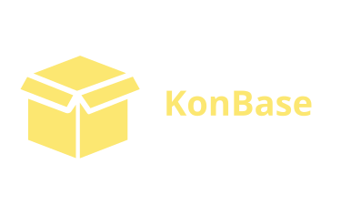

KonBase is an **open-source platform** designed to help convention organizers and associations manage their inventory, staff, and event logistics. Our mission is to provide a transparent, community-driven solution for real-world problems faced by clubs, fan groups, and event teams.

---

## 🚀 What We Do

- **Inventory Management:** Track equipment, consumables, and locations for your organization.
- **Convention Planning:** Organize multi-day events, assign staff, and manage schedules.
- **Association Tools:** Support for multiple associations, member roles, and permissions.
- **Reporting & Analytics:** Gain insights into your operations with built-in reports.
- **Security:** Role-based access control, audit logging, and optional two-factor authentication.

**We are not** a commercial SaaS company. KonBase is built by volunteers and enthusiasts who want to make event management easier for everyone. Our features are shaped by real user needs and community feedback.

---

## 💬 Join Our Community

We believe in open collaboration and learning together. Whether you're an organizer, developer, or just curious, you are welcome here!

- **Discord:** [Join our Discord server](https://discord.gg/konbase) for support, feature discussions, and community chat.
- **GitHub Issues:** [Report bugs or request features](https://github.com/ShiroLuxferre/KonBase/issues).
- **Discussions:** [Share ideas and feedback](https://github.com/ShiroLuxferre/KonBase/discussions).

---

## ☕ Support the Project

If you find KonBase helpful, consider supporting us:

- **Buy Me a Coffee:** [Support development](https://www.buymeacoffee.com/konbase)
- **GitHub Sponsors:** Coming soon!

Your support helps us cover hosting costs and motivates us to keep improving the platform.

---

## 🤝 Contributing

We welcome all contributions—code, documentation, testing, or just sharing your experience. Check out our [CONTRIBUTING.md](./CONTRIBUTING.md) for how to get started.

---

## 📢 100% Honest Scope

- **KonBase is a work in progress.** Some features are experimental or under development.
- **We rely on community feedback** to prioritize improvements.
- **No paid support or commercial guarantees.** This is a community project, maintained as time allows.
- **Your data is yours.** We do not monetize user data or run ads.

---

## 📜 License

KonBase is licensed under the [MIT License](./LICENSE.md).

---

  Made with ❤️ by the KonBase community

